Listener 是 **IoM 中的分布式监听服务** ，负责与 Implant 建立和维持实际的通信。

- **分布式部署** ：可以部署在任意服务器上，而不是和IoM Server绑定。
    
- **与 Server 解耦** ：通过 gRPC Stream 与 Server 全双工通信，实现独立运行和故障隔离。
    
- **多形态支持** ：可根据需要伪装或隐藏通信方式。
    
- **实时交互** ：保持 Implant 与 Server 的实时双向通信。

> **Tip:**
	具体架构在[Listener 架构](../server/listeners.md)查看


## listener 配置
listener目前有两种方式控制，config.yaml和root命令行。config.yaml能够配置更多的listener相关信息，root命令行只能负责listener的新增、删除和展示。

当需要修改listener的外网ip时，通过修改对应listener的 `ip` 字段来修改。

```yaml
listeners:
  name: listener  
  ip: 127.0.0.1  
```

也可以使用服务端的启动参数 `-i` ，重新启动服务端来重载ip。

```bash
./malice-network -i 123.123.123.123
```

当listener的凭证信息需要重新指定时，通过listener的 `auth` 字段来修改凭证文件地址。

```yaml
listeners:
  name: listener
  auth: listener.auth  
```

### listener root 命令管理

当您需要添加一个新的listener， 在确保 **Malice-Network** 服务器已经运行后，在终端输入以下指令：

`listener add` / `listener del` 属于 `RootRPC` 身份管理操作，默认只允许在 Server 本机 localhost 调用。远程 WebUI 或远程 admin 客户端需要执行这些操作时，需要在 Server `config.yaml` 的 `server.root_rpc` 中显式开启远程 RootRPC，并限制来源 CIDR 和允许的方法。

```powershell
.\malice-network listener add [listener_name]
```

执行命令成功后，服务端会输出以下信息并在所处文件夹下生成对应 auth 配置文件：

也可以使用以下命令删除listerner

```
.\malice-network listener del [listener_name]
```


### 独立部署listener

从项目设计开始，我们就将listener和server解耦，可以通过启动命令独立部署listener，需要将malice-network、listener.yaml（或默认config.yaml）和xxx.auth放到独立的机器然后执行--listener-only。纯listener-only配置可以只保留`listeners`段，不需要`server`段。

```bash
./malice-network --listener-only -c listener.yaml
```

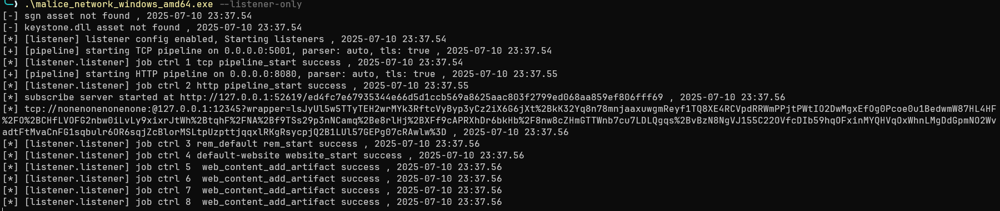

### forward listener 连接管理

默认 `reverse` 模式下，Listener 主动连接 Server。`forward` 模式下，Listener 在本地启动 forward gRPC 服务，Server 主动拨入 Listener：

```yaml
listeners:
  name: listener-a
  ip: 10.10.1.20
  transport: forward
  forward:
    listen_host: 0.0.0.0
    listen_port: 5005
```

远程 Listener 的最小配置只需要监听地址和监听端口。Server 要连接哪个 Listener 地址，由 Server 侧配置或 `listener forward connect --host/--port` 决定。

如果不想只依赖 Server 启动配置，也可以由 Client 请求 Server 临时连接一个已注册的 forward Listener：

```bash
listener forward connect listener-a --host 10.10.1.20 --port 5005
listener forward status listener-a
listener forward list
listener forward disconnect listener-a
```

动态连接的 `--host` 是必填项，表示 Server 当前要拨号访问的 Listener 地址；`--port` 默认是 `5005`。Server 不会把 DB 里的 `Remote` 自动当作 forward 连接地址，避免误连到 Client 注册来源或本机地址。

这个命令不会把 Root CA 私钥、Listener 私钥或 `listener.auth` 发给 Client。Server 只用本地 Root CA 生成的 forward client cert 去连接 Listener；Listener 使用自己的 `listener.auth` 作为 server cert。`listener.auth` 的格式仍然只有 `ca/cert/key`，新生成的 Listener 证书同时支持 `clientAuth` 和 `serverAuth`。

动态连接要求 Server DB 中已经存在同名 Listener Operator 记录。Server 会用该记录里的证书 fingerprint 校验 Listener forward server cert，防止 Client 把 Server 引到同 CA 下的其他证书。forward mTLS 不把拨号 host 当作 Listener 身份来源；证书身份由 Root CA、`serverAuth` EKU 和 Operator fingerprint 决定。forward 管理命令需要 admin 权限，普通 operator 不能发起或断开 forward Listener 连接。


### 远程关闭 Listener

如果需要让 Server 主动关闭一个已连接 Listener，可以使用 retire 命令：

```bash
listener retire listener-a --yes
```

默认行为会让 Listener 停止本地运行时，并在 Server 侧清理连接状态，同时 revoke 同名 Listener Operator，防止同一份 `listener.auth` 再次连回 Server。

配置文件和 auth 文件不会默认删除；需要删除时显式加 flag：

```bash
listener retire listener-a --purge-config --purge-auth --yes
```

`--purge-config` 删除 Listener 启动时 `-c` 指向的配置文件，`--purge-auth` 删除该配置里 `listeners.auth` 指向的 auth 文件。`--no-revoke` 可以保留 Server DB 中的 Listener Operator，但只建议在临时重启或测试时使用。`--timeout` 可以调整等待 Listener 确认 retire 的秒数。


### autobuild 配置
目前启动一个listener时，可以通过autobuild的配置，来控制是否编译与当前listener通信的implant。

如果需要编译pulse artifact，将auitobuild的 `build_pulse` 设为true。

```yaml
  auto_build:
    build_pulse: true
```

您可以根据实际需求，来配置自动编译的implant的架构和通信的pipeline，implant支持的架构在[构建操作](build.md)中有显示。autobuild中的 `pipeline` 字段需要和已有的pipeline名对应。

```yaml
  auto_build:
    target:
      - x86_64-pc-windows-gnu
      - x86_64-unknown-linux-musl
    pipeline:
      - tcp
      - http
```

> **Tip:**
	autobuild的编译平台优先级为docker > github action > saas，若使用saas编译，需确保服务端的config.yaml配置了saas，并且服务端未启动docker，也没有在config.yaml中配置github仓库信息。
### pipeline 配置

pipeline是数据管道，Listener与Implant/WebShell交互的具体实现。

**概念说明** : Pipeline相当于传统C2框架中的Listener概念，但IoM进一步细分了其实现。每个Listener可以运行多个Pipeline，Pipeline负责与Implant的具体交互。

> **Tip:**
	具体架构在[Listener 操作](listener.md)查看

#### tcp

当需要启动一个新的tcp pipeline的时候，可以在config.yaml中的对应listener下增加一个tcp配置。

```yaml
  tcp:
  - name: tcp               # tcp 名字
        port: 5001          # tcp 监听的端口
        host: 0.0.0.0       # tcp 监听的host
        parser: malefic 	# implant协议
        enable: true        # tcp 是否开启
        tls:                # tls配置项
          enable: false
```

也可以在IoM的client端中使用命令添加一个tcp pipeline：

```bash
tcp --listener listener --host 127.0.0.1 --port 5015
```

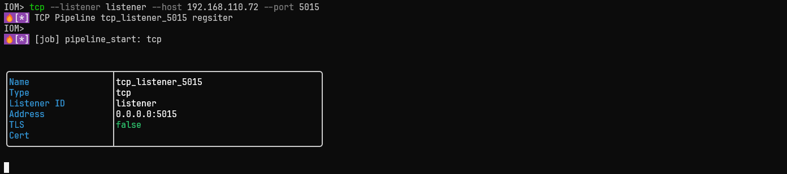

> **Tip:** "tcp命令"
	关于tcp命令的更多使用方法，请查阅[命令参考](../reference/commands/client.md)

在gui中，可以在listener界面中点击new pipeline，选择pipeline type为tcp后添加。

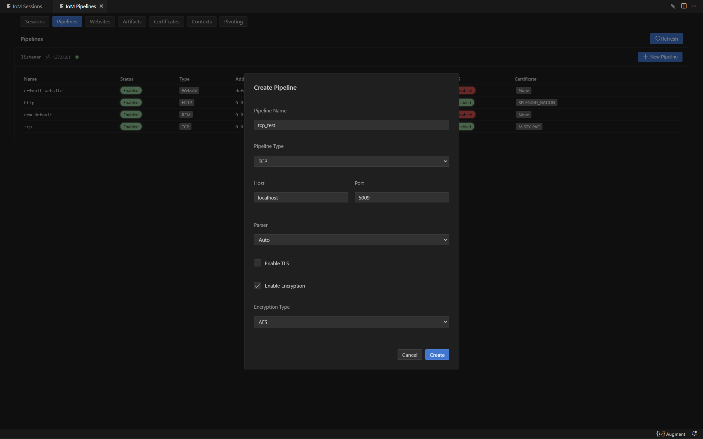

#### http

当您需要启动一个新的http pipeline的时候，可以在config.yaml中的对应listener下增加一个http配置。

```yaml
  http:	
    - name: http          # http 名字
      enable: true        # http 是否开启
      host: 0.0.0.0       # http 监听的host
      port: 8080          # http 监听的端口
      parser: malefic     # implant协议
      tls:                # tls配置项
        enable: false  
```

也可以在IoM的client端中使用命令添加一个http pipeline：

```bash
http --listener listener --host 127.0.0.1 --port 8083
```

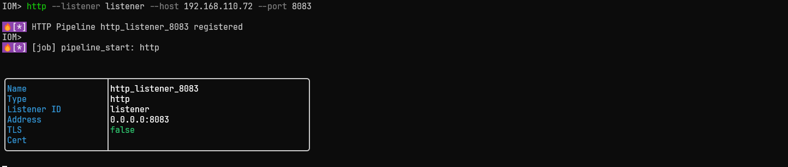

> **Tip:** "http命令"
	关于http命令的更多使用方法，请查阅[命令参考](../reference/commands/client.md)

在gui中，可以在listener界面中点击new pipeline，选择pipeline type为http后添加。
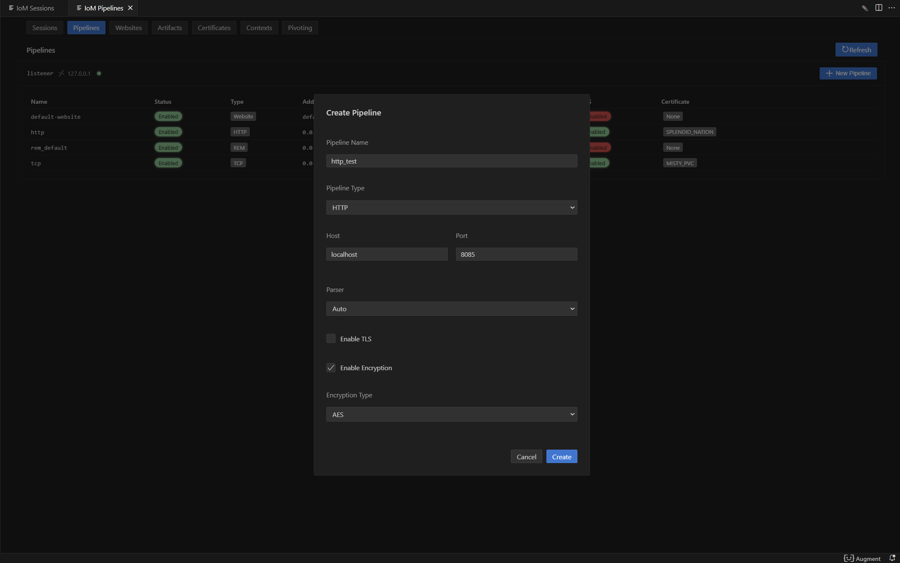

> **Tip:** 
	 pipeline是和implant相互通信的，所以两者配置需要相互匹配，implant的tcp和http配置在[构建操作](build.md)查看。
#### website

当您需要启动一个新的website pipeline的时候，并将一些文件挂载website pipeline 服务上时，可以在config.yaml中的对应listener下增加一个website 配置。

```yaml
  websites:             
    - name: test		             # website 名字
      port: 10049		             # website 端口
      root: "/test"		             # website route根目录
      enable: true                  # website 是否开启
      content:			             # website 映射内容
        - path: '\images\1.png'      # 文件在website的映射路径
          file: 'path\to\file'       # 文件的实际路径
          name: image-1              # 展示名
          comment: landing image     # 备注
          auth: none                 # 跳过website默认Basic Auth
          type: raw                  # 文件类型
        - path: '\images\2.png'
          file: 'path\to\file'
          type: raw
```

也可以在IoM的client端中使用命令添加一个website pipeline：
```bash
website web-test --listener listener --port 5080 --root /web
```

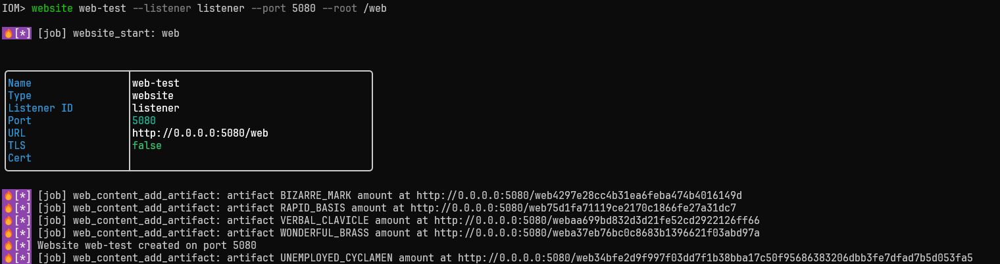

然后再在对应website上传文件
```bash
website add /path/to/file --website web-test --path /path --name payload --comment "first payload"
website update <content_id> --name payload-v2 --comment "rotated payload"
website add --artifact artifact-name --website web-test --format shellcode --path /payload.bin
```


> **Tip:** "website命令"
	关于website命令的更多使用方法，请查阅[命令参考](../reference/commands/client.md)


在gui上，需要先在website界面上，点击new website按钮，在website新建按钮中输入对应信息，来新建website pipeline。

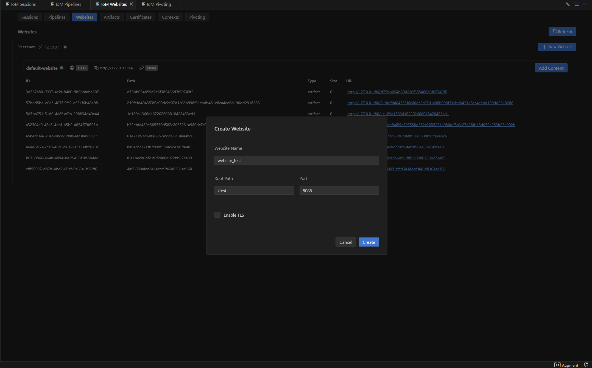

随后在对应website pipeline的点击add content按钮，填写需要的website content后添加:

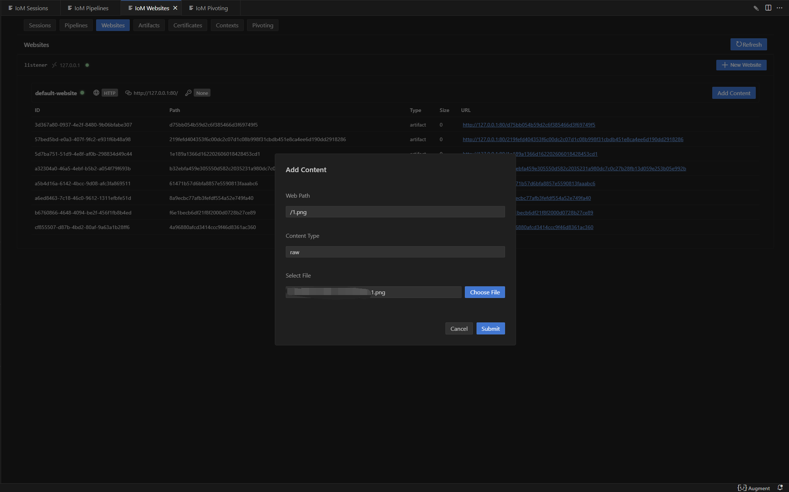

#### rem 

当您需要启动一个新的rem pipeline的时候， 可以在config.yaml中的对应listener下增加一个rem配置。

```yaml
  rem:                     
    - name: rem_default              # rem 名字
      enable: true                   # rem 是否开启
      console: tcp://0.0.0.0:12345   # rem 控制台监听地址和连接协议
```
这个pipeline可以给普通的==rem==二进制文件直接使用， 也可以让client与implant连接。
不再需要下载独立的==rem==程序， IoM的server就可以当作==rem==的服务端， 并提供了更多的管理功能。

> **Tip:** "rem指南" 
	在 IoM 中，绝大部分网络相关功能都基于 **rem** 实现。因此，在使用这些功能前，建议先阅读 [rem](/rem) 文档，以便更好地熟悉其用法。  
    关于在 implant 中如何使用 **rem** ，可参考 [rem_usage](proxy.md)。
#### bind (Unstable)

当您需要启动一个新的bind pipeline的时候， 可以在config.yaml中的对应listener下增加一个bind配置。

```yaml
  bind:
    -
      name: bind_default            # bind 名字
      enable: true                  # bind 是否开启
```
  
## 高级功能
### pipeline的tls配置

当您的需要tcp、http和website pipeline使用tls时，您可以通过config.yaml或者命令行的方式来配置tls。
#### config配置tls
使用config.yaml配置tls时，只需在对应的pipeline下增加tls证书配置，以下是示例config：

```yaml
  tcp:
  - name: tcp               
        port: 5001          
        host: 0.0.0.0       
        parser: malefic 	
        enable: true        
        tls:                              # tls配置项
          enable: true
```

当您没有证书时，只需要将config.yaml中需要对应pipeline的tls的 `enable` 设为true，即可使用随即生成自签名证书。
若您已经有证书，并希望pipeline使用该证书，则可以将证书路径填入tls配置中，以下是示例config：
```yaml
  tcp:
  - name: tcp               
        port: 5001          
        host: 0.0.0.0       
        parser: malefic 	
        enable: true        
        tls:                              # tls配置项
          enable: true
          cert_file: path\to\cert         # 证书文件路径，支持PEM格式的证书文件
          key_file: path\to\key           # 私钥文件路径，支持PEM格式的私钥文件
          ca_file: path\to\ca             # CA证书文件路径(可选)，用于验证客户端证书的CA证书
```

#### client配置tls
使用client配置tls，需要保证服务器已经存储了需要的证书。
若您需要服务端生成自签名证书，可以用该命令生成自签名证书。

```bash
cert self_signed
```

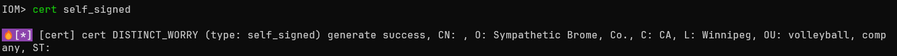

gui则是在certificates界面点击Generate Self-signed Certificate按钮后，服务端会生成自签名证书。

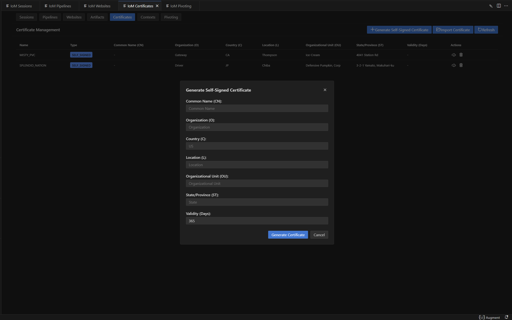

若您需要服务端存储您的已有证书，可以用该命令将证书上传至服务端。

```bash
cert import --cert cert.crt --key key.crt--ca-cert ca.crt
```

 
gui则是在certificates界面点击Imported Certificate按钮后，证书上传至服务端。
 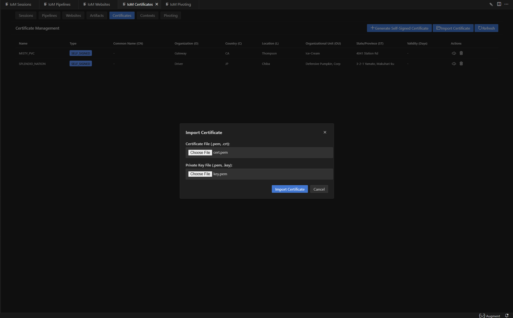
当服务器已存储所需证书后，可以通过以下命令，将pipeline使用新的证书配置启动。

```bash
pipeline start tcp --cert-name cert-name
```


> **Tip:** "tls指南" 
	当您打开tls配置时，您需要确保Implant的tls配置也打开，implant的tls配置请在[构建操作](build.md)参阅。
	listener上的tls具体配置可以在[Listener 操作](listener.md)查看。
### Parser

当您需要使用pipline和pulse类型的implant通信时，需要修改 `parser` 字段，设置为pulse即可。以下是pulse配置示例:

```yaml
    tcp:
	- name: shellcode
      port: 5002
      host: 0.0.0.0
      parser: pulse    # 对应malefic-pulse上线
      enable: true
      encryption:
        enable: true
        type: xor
        key: maliceofinternal
```

> **Tip:** "parser指南"
	具体Parser配置可以在[Listener 操作](listener.md)查看。
### Encryption
若您需要添加pipeline和implant的通信加密时，在config.yaml下对应的pipeline下添加新的encryption字段，即可配置加密协议。

```yaml
    tcp:
	- name: shellcode
      port: 5002
      host: 0.0.0.0
      parser: pulse    
      enable: true
      encryption:
        - enable: true               # 是否启用该加密方式
          type: aes                  # 加密类型 (支持: aes / xor)
          key: maliceofinternal      # 密钥 (implant 需一致)
```

> **Tip:** "encryption指南" 
	具体Encryption配置可以在[Listener 操作](listener.md)查看。
	如何在Implant上配置对应的Encryption，请在[Listener 操作 - Encryption](listener.md)查看。
### http自定义响应内容

当您需要对http pipeline自定义配置对应的响应内容,可以在config.yaml中配置。
```yaml
 http:	
    - name: http         
      enable: true        
      host: 0.0.0.0       
      port: 8080          
      parser: malefic     
      tls:                
        enable: true  
      headers:                               # 自定义响应头 (map[string][]string)
        Server: ["nginx/1.22.0"]
        Content-Type: ["text/html; charset=utf-8"]
        Cache-Control: ["no-cache"]
      error_page: "/var/www/error.html"       # 404/500 错误页面路径
      body_prefix: "<!-- prefix marker -->"   # 每个 HTTP 响应 body 前缀内容 
      body_suffix: "<!-- suffix marker -->"   # 每个 HTTP 响应 body 后缀内容
```

- **`headers`**：  
    可以定义多个 HTTP 响应头，例如伪装成 Nginx/Apache，或者返回自定义的 Content-Type。

- **`error_page`**：  
    指定一个文件路径作为错误页面，返回时可替代默认的错误内容。

- **`body_prefix` / `body_suffix`**：  
    在 HTTP 响应体的最前/最后拼接额外内容，用于混淆流量或伪装网页。
